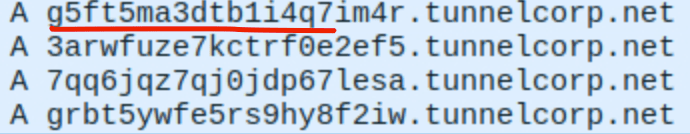

# Data Exfiltration Detection

  

# Overview
While Phoebe would kindly return Ross' *The Science Boy* and apologize for what she's done. A hacker, on the other hand, would not be so nice. Data is the core of the cybersecurity (and probably the modern technology). Different protocols can be used for this: DNS, FTP, HTTP, SMTP

## 2. Description
### 2.1 Common phases related to exfiltration
- **Discovery / Collection**: attacker locates sensitive files. 
- **Staging / Compression**: attacker aggregates, compresses, encrypts, or encodes files (ZIP, RAR, 7z, tar, base64, steganography).
- **Exfiltration transport**: transfer over network, removable media, cloud, or covert channels.
- **Command & Control (C2) coordination**: orchestrates transfer and confirms receipt.

### 2.2 Indicators 
- Large or frequent outbound uploads (proxy/firewall) 
- Long or high-entropy DNS queries 
- Suspicious process command-lines and network connections (Sysmon/EDR)
- Cloud storage API activity, removable-media events
- Abnormal volumn of protocol of: DNS, FTP, HTTP, SMTP

### 2.2.1 DNS Tunneling 
- Basic indicators
	- weird subdomain 
	- abnormal size of query (>70)
- Advanced indicators 
	- hight entropy or base32/64 patterns in the query names
	- rare record types (TXT, NULL)
	- regular intervals (beacons)
	- 

### 2.2.2 FTP
- FTP can be used for tranport data. It is sent in plain text so easier to be seen.
- Indicators :
	- abnormal large packet size
	- look for keyword such as "USER", "PASS", "STOR"
	- Reading Reading: [Bo Cyber Logbook - Wireshark FTP](../tools/wireshark-ftp.md)

### 2.2.3 HTTP
- Perhaps the most common protocol 
- indicators:
	- large HTTP request to an external host
	- chunked or multipart transfers where multiple requests compose a larger file.

### 2.2.4 SMTP 
- It is commonly allowed through firewalls and typically inspected less strictly than TCP/UDP, attackers sometimes abuse ICMP to tunnel and exfiltrate data.
- indicators:
	- high entropy, base64 
	- huge payload (normal ping ~74 bytes)
	- type 8 echo, type 0 reply

